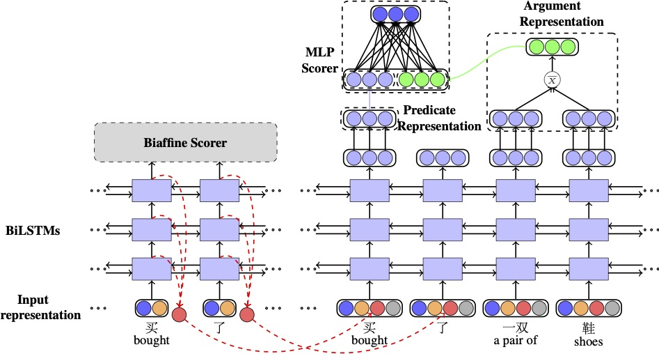

# A Syntax-aware Multi-task Learning Framework for Chinese Semantic Role Labeling
This repository contains codes and configs for training models presented in : [A Syntax-aware Multi-task Learning Framework for Chinese Semantic Role Labeling](https://kirosummer.github.io/documents/papers/a_syntax_aware_mtl_framework_for_chinese_SRL.pdf)

## Framework

## Data
If you have the CPB1.0 and CoNLL-2009 Chinese data, you can convert the original format into the json format using the scripts.

To use our code, you should install pytorch >= 0.4.0.

## Train
To train our neural models, you should set the train.sh and config.json. Then, run
```bash
nohup ./train.sh 0 > log.txt 2>&1 &
```
where 0 is the GPU id.
We also give an corresponding example in exp-baseline-MTL-IIR/

## Test
For test, you should run the predict.sh presentated in the exp-baseline-MTL-IIR/ dir.
```bash
./predict.sh 0
```
## Significance Test and Evaluation
We put the Dan Bikel's comparer in the scripts directory. The workflow is as follows:
#### 1. To get the sentence-level F1 score of model A and B
A.output should be conll format
```
python2 each_sentence_analysis.py A.output > A.evalb
python2 each_sentence_analysis.py B.output > B.evalb
```
#### 2. Move into the dir ``significance_test'' and conduct the evaluation to get the *p_value for precision*.
```
perl compare.pl -n 10000 A.evalb B.evalb
```

